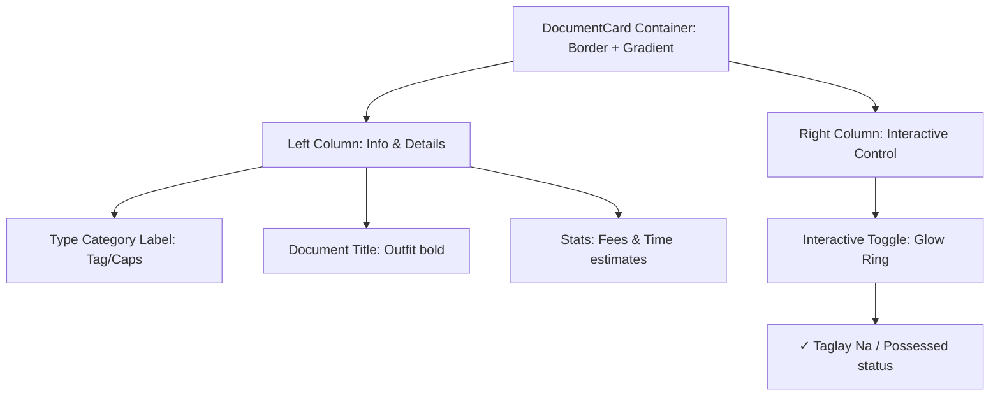

# Google Stitch Design System & Frontend Redesign Blueprint

> **Project**: LakadPapel (Filipino Government Document Navigator)  
> **Framework**: React Native Expo (Offline-First)  
> **Design Specification**: Google Stitch high-fidelity AI-native structure  
> **Source of Truth File**: `DESIGN.md`

---

## 1. Design Philosophy & Aesthetic Vision

LakadPapel transitions from a standard layout to a **Premium, AI-optimized Visual Engine**. The core interface balances high-density utility with modern, frictionless aesthetics, ensuring both low-literacy users (Simple Mode) and power users (Advanced Mode) receive a world-class experience.

### Aesthetic Pillars:
*   **Modern Glassmorphism**: Soft background blurs, thin luminous borders, and floating cards to create depth without visual clutter.
*   **Sleek Neo-Neon Palette**: High-contrast, tailored HSL color scales designed to look stunning in both natural sunlight and absolute dark mode.
*   **Adaptive Structural Complexity**: Simple Mode utilizes friendly large touch targets and progress indicators, while Advanced Mode adopts a high-tech glowing network node aesthetic.
*   **Contextual Micro-Animations**: Interactive components respond with subtle spring physics, scale-down state triggers, and luminous color fades to feel reactive and "alive."

---

## 2. Design Tokens (The Unified Schema)

### 2.1 Core HSL Color Palettes

Google Stitch uses HSL scales for programmatic control of color transparency, contrast, and theme transitions.

#### Light Mode Theme
| Token Name | HSL Value | Hex Equivalent | UI Application |
| :--- | :--- | :--- | :--- |
| `--bg-primary` | `hsl(210, 20%, 98%)` | `#F8F9FA` | Main screen background |
| `--bg-card` | `hsl(0, 0%, 100%)` | `#FFFFFF` | Floating cards, modals |
| `--text-main` | `hsl(215, 28%, 17%)` | `#1E293B` | High-contrast headings, body |
| `--text-muted` | `hsl(215, 16%, 47%)` | `#64748B` | Captions, small secondary notes |
| `--border-subtle` | `hsl(214, 32%, 91%)` | `#E2E8F0` | Default card and list item borders |
| `--primary` | `hsl(221, 83%, 53%)` | `#2563EB` | Active buttons, brand indicators |
| `--primary-glow` | `hsla(221, 83%, 53%, 0.15)` | — | Under-card shadows, active highlights |

#### Premium Cyber Dark Mode (Default Mode)
| Token Name | HSL Value | Hex Equivalent | UI Application |
| :--- | :--- | :--- | :--- |
| `--bg-primary` | `hsl(224, 71%, 4%)` | `#020617` | True deep-space slate background |
| `--bg-card` | `hsl(222, 47%, 7%)` | `#0B132B` | Glassmorphic floating card surface |
| `--text-main` | `hsl(210, 40%, 98%)` | `#F1F5F9` | Luminous, readable text |
| `--text-muted` | `hsl(215, 20%, 65%)` | `#94A3B8` | Subtext, labels |
| `--border-subtle` | `hsl(217, 33%, 17%)` | `#1E293B` | Thin neon border divider |
| `--primary` | `hsl(199, 89%, 48%)` | `#0EA5E9` | Cyber cyan active elements |
| `--primary-glow` | `hsla(199, 89%, 48%, 0.25)` | — | Neon drop glows, network connections |

#### Shared Semantic Accents
| Accent Name | Theme | HSL Value | UI Application |
| :--- | :--- | :--- | :--- |
| `--success` | Light / Dark | `hsl(142, 70%, 45%)` / `hsl(142, 72%, 29%)` | Completed milestones, positive badges |
| `--success-glow`| Dark | `hsla(142, 72%, 29%, 0.3)` | Luminous green drop glows for "Owned" nodes |
| `--warning` | Light / Dark | `hsl(38, 92%, 50%)` / `hsl(38, 92%, 35%)` | Local barangay/school warning alerts |
| `--danger` | Light / Dark | `hsl(0, 84%, 60%)` / `hsl(0, 84%, 45%)` | Danger cache wipe borders, locked steps |

---

### 2.2 Typography Scale
Using **Outfit** for structural display headings and **Inter** for dense tabular, data-heavy requirements.

```
Font Primary (Headings):   'Outfit_700Bold', 'Outfit_600SemiBold'
Font Secondary (Body):     'Inter_600SemiBold', 'Inter_500Medium', 'Inter_400Regular'
```

| Type Scale Token | Font Family | Size | Weight | Line Height | Letter Spacing |
| :--- | :--- | :--- | :--- | :--- | :--- |
| `display-xl` | Outfit | `28px` | Bold | `34px` | `-0.02em` |
| `heading-lg` | Outfit | `20px` | SemiBold | `26px` | `-0.01em` |
| `body-md` | Inter | `15px` | Medium | `22px` | `0` |
| `body-sm` | Inter | `13px` | Regular | `18px` | `0` |
| `caption-xs` | Inter | `11px` | SemiBold | `14px` | `0.05em` (uppercase) |

---

### 2.3 Layout, Spacing & Border Scales
Stitch operates on a strict **4px modular grid** structure:

```
--space-1xs: 4px
--space-xs:  8px
--space-sm:  12px
--space-md:  16px
--space-lg:  24px
--space-xl:  32px
--space-2xl: 48px

--radius-sm: 6px   (Badges, sub-controls)
--radius-md: 12px  (Standard items, small lists)
--radius-lg: 20px  (Core display cards, modular settings)
--radius-full: 999px (Floating Action Buttons, pills)
```

---

## 3. High-Fidelity Component Architectures

### 3.1 The Redesigned Modern Checklist Card (`src/components/DocumentCard.tsx`)

#### Light Mode View:
*   A crisp white card with a subtle gradient border.
*   The checkmark is replaced with an elegant **Progress Ring** (hollow when missing, solid glowing emerald when possessed).

#### Dark Mode View:
*   Deep slate body background (`--bg-card`) with a ultra-thin (`0.5px`) neon-glow border.
*   Subtle HSL background gradient overlay shifting from bottom-left to top-right to indicate possession status.

#### Component Anatomy (Stitch Layout):


#### Interaction States (Stitch Specification):
*   **Idle**: Outer boundary opacity set to `0.3`. Subtext scale at `1.0`.
*   **Pressed**: The entire container scales down via spring physics to `0.98` with a subtle haptic feedback kick (`impactLight`).
*   **Active (Possessed)**: The gradient border turns vibrant emerald (`--success`). An inner radial glow emits from the right side of the card. A small low-contrast status badge slides out saying: `✓ Taglay Na` (Tagalog) or `✓ Already Have This` (English).

---

### 3.2 The Proximity Milestone Step Card (`src/components/StepCard.tsx`)

A floating vertical timeline step. Under Simple Mode, this is a friendly step-by-step card. Under Advanced Mode, it incorporates cyber-neon nodes connecting the pipeline.

#### Component Blueprint (Google Stitch spec):
*   **The Connected Spine**: A vertical dotted conduit connecting cards. If a step is ready to be taken (i.e. has no missing prerequisites), the spine conduit glows cyan (`--primary`). If it is locked, it shows a subtle dotted slate grey.
*   **The Card Body**:
    *   **Header Area**: The step number floats inside a small solid circular badge with a background glow (`--primary-glow`).
    *   **Body Content**: Displays the document name in Outfit Bold, followed by an elegant tabular breakdown of fees and processing times.
    *   **Proximity Routing Module**: Integrates the `BranchCard` in an embedded sub-panel. Under dark mode, it displays the verified branch with a miniature glowing GPS target icon, its coordinate distance, and a prominent call-to-action button to navigate instantly.

```
+-------------------------------------------------------------+
|  ( 1 )  PSA Birth Certificate                               |
|         Fee: PHP 155.00  |  Time: 2-3 Working Days          |
|                                                             |
|   +-----------------------------------------------------+   |
|   |  📍 PSA East Avenue (Main Headquarters)             |   |
|   |     Quezon City | 1.2 km away                       |   |
|   |     Mon-Fri, 7:00 AM - 5:00 PM                      |   |
|   |                                                     |   |
|   |  [🧭 Kumuha ng Direksyon / Get Directions]           |   |
|   +-----------------------------------------------------+   |
|                                                             |
|   [ Mark As Completed / Tapos Na ]                          |
+-------------------------------------------------------------+
```

---

### 3.3 The Neon Network Canvas (`src/components/DAGExplorer.tsx`)

This is the flagship component of the redesign in **Advanced Mode**. It replaces simple checklists with a fully interactive, reactive vector network canvas.

#### Redesign Specifications:
*   **Canvas Base**: Set to true absolute dark `#020617` to allow neon colors to pop.
*   **The Grid System**: Render a subtle dot-matrix background graph pattern using `--border-subtle` at `0.1` opacity.
*   **Active Graph Nodes**:
    *   **Possessed Nodes**: Soft green boundary glow (`--success-glow`), showing a compact green check indicator.
    *   **Available Nodes**: Cyan border with a breathing radial animation loop (`0.8` to `1.2` scale opacity over 3 seconds).
    *   **Locked Nodes**: Minimalist dark-slate frame, semi-transparency (`0.4` opacity), showing an elegant lock icon.
    *   **Active Target Node**: Thick border, pulsating gold outline, emitting a soft radial breathing ring around it to draw immediate focus.
*   **Edge Connectors**: SVG Paths with adjustable strokes. When the target path is active, a glowing particle pulse animates along the SVG lines, moving from parent nodes to child nodes using a standard SVG stroke-dashoffset transition.

---

### 3.4 The Premium Settings Dashboard (`app/settings.tsx`)

Organized into clear visual rows grouped inside unified `--radius-lg` settings containers.

#### Layout Organization:
*   **Header Section**: Premium welcome title in Outfit display font.
*   **Setting Container 1: Preferences**:
    *   *Dark Mode*: Clean switch with custom HSL track transitions.
    *   *Language*: Interactive high-fidelity segment pill selector (English / Tagalog).
*   **Setting Container 2: Services**:
    *   *Location Services*: An advanced status control card. Shows the current permission state (`Granted` or `Denied`) as a prominent status indicator. If denied, tapping launches an interactive system flow directly to system settings.
*   **Setting Container 3: Utilities**:
    *   *Clear Saved Checklists*: Styled in deep warning crimson (`--danger`), alerting the user that this action wipes stored credentials.
*   **Database Version Card**: High-fidelity modular card showing active network details: "v2.1 Database (114 Branches Verified)".

---

## 4. Google Stitch Interface Integration Mapping (Stitch to App)

This map defines how the generated design system tokens map to the actual React Native component properties:

```
Stitch CSS Variable     -->   React Native Style mapping
----------------------------------------------------------------------
--bg-primary            -->   themeColors.background
--bg-card               -->   themeColors.cardBackground
--text-main             -->   themeColors.text
--text-muted            -->   themeColors.subText
--border-subtle         -->   themeColors.border
--primary               -->   themeColors.primary
--success               -->   colors.green600 / success color palette
--warning               -->   colors.amber600 / warning alert color
--danger                -->   colors.red500 / danger accent colors

--font-primary-bold     -->   fontFamily: 'Outfit_700Bold'
--font-primary-semibold -->   fontFamily: 'Outfit_600SemiBold'
--font-body-medium      -->   fontFamily: 'Inter_500Medium'
--font-body-regular     -->   fontFamily: 'Inter_400Regular'

--radius-lg             -->   borderRadius: 20
--radius-md             -->   borderRadius: 12
--radius-sm             -->   borderRadius: 6
```

---

## 5. Next Steps for Implementation

Once the system environment triggers the styling MCP, the design will be implemented directly across the codebase using the following process:

1.  **Phase 1: Token Declaration (`src/theme.ts`)**:
    *   Define Outfit and Inter fonts.
    *   Translate HSL Google Stitch parameters into the global static theme system, ensuring light and dark variants are declared cleanly.
2.  **Phase 2: Base Components Refactoring**:
    *   Inject the glassmorphic aesthetics and interactive spring-animations into `DocumentCard.tsx` and `StepCard.tsx`.
3.  **Phase 3: Screen Assembly**:
    *   Update `checklist.tsx`, `roadmap.tsx`, and `settings.tsx` to utilize the modular borders, spacing scales, and high-fidelity layouts.
4.  **Phase 4: Network Explorer Polish**:
    *   Rewrite the SVG canvas styling inside `DAGExplorer.tsx` to introduce the cyber-neon grid, glowing SVG paths, and pulsating target animations.
